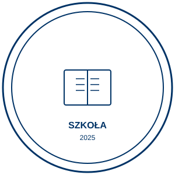

# CLAUDE.md - AI Assistant Guide

> Comprehensive guide for AI assistants working with the IAM POLAND SP Z O.O. School Seal Repository

---

## Repository Overview

**Repository Name:** MDR-cosmomed-Izabela-Za-cka-
**Purpose:** Official school seal template and documentation for IAM POLAND SP Z O.O.
**Type:** Static asset repository (documentation and design assets)
**Primary Language:** Polish
**Created:** 2025-10-26
**Version:** 1.0

### What This Repository Is

This is a **content/asset repository**, NOT a software development project. It contains:
- The official school seal in SVG format (scalable vector graphics)
- Comprehensive Polish-language documentation
- An interactive HTML preview page
- No code to compile, build, or test

### Key Characteristics

- **Static assets only** - No build process, no dependencies, no compilation
- **Polish language** - All documentation is in Polish
- **Institutional use** - Licensed for official use only by authorized IAM POLAND personnel
- **Zero dependencies** - Self-contained repository with no external packages
- **Version controlled** - Simple Git workflow for tracking changes to the seal design

---

## Repository Structure

```
MDR-cosmomed-Izabela-Za-cka-/
├── README.md                   # Minimal description (52 bytes)
├── INSTRUKCJA-PIECZEC.md      # Primary documentation (4,033 bytes)
├── pieczec-szkolna.svg        # School seal SVG file (1,856 bytes)
├── wzor-pieczeci.html         # Interactive preview page (6,979 bytes)
├── CLAUDE.md                  # This file - AI assistant guide
└── .git/                      # Git repository metadata
```

### File Descriptions

| File | Purpose | When to Modify |
|------|---------|----------------|
| `pieczec-szkolna.svg` | **Primary deliverable** - The official school seal in SVG format | When updating year, colors, or design elements |
| `INSTRUKCJA-PIECZEC.md` | **Primary documentation** - Comprehensive usage guide, specifications, and instructions (Polish) | When specifications or usage guidelines change |
| `wzor-pieczeci.html` | Interactive preview showing the seal at multiple sizes with embedded styling | When adding new preview features or updating instructions |
| `README.md` | Minimal repository description | Rarely - kept minimal by design |
| `CLAUDE.md` | Guide for AI assistants (this file) | When repository patterns or conventions change |

---

## Codebase Analysis

### Technical Stack

**Languages:**
- **SVG (XML)** - Scalable vector graphics format for the seal
- **HTML5** - Static preview page with embedded CSS
- **Markdown** - Documentation format

**Frameworks/Libraries:** None
**Build Tools:** None
**Package Managers:** None
**Testing Framework:** None
**CI/CD:** None
**Dependencies:** Zero external dependencies

### No Build Process

This repository requires **no compilation, bundling, or build steps**. All files are production-ready and can be used immediately:

- `pieczec-szkolna.svg` can be opened in any SVG-compatible application
- `wzor-pieczeci.html` can be opened directly in any modern browser
- Documentation files are readable as plain text or rendered markdown

---

## Design Specifications

### SVG Seal Structure

The seal is defined in `pieczec-szkolna.svg` with the following specifications:

#### Dimensions
- **Canvas size:** 300×300 px
- **Outer circle radius:** 145 px (stroke: 3px)
- **Inner circle radius:** 130 px (stroke: 2px)
- **Center point:** (150, 150)

#### Visual Elements
1. **Double circle border** - Navy blue outline (`#003366`)
2. **Curved upper text** - "IAM POLAND SP Z O.O." (along circular path)
3. **Center symbol** - Open book (education icon) at coordinates (110, 120) to (190, 180)
4. **Bottom text** - "SZKOŁA" (School) at y=220
5. **Year indicator** - "2025" at y=240

#### Typography
- **Font family:** Arial, sans-serif
- **Upper text size:** 24px, bold, letter-spacing: 4
- **Bottom text size:** 16px, bold
- **Year size:** 12px

#### Color Palette
- **Primary color:** `#003366` (Navy blue) - Used consistently across:
  - SVG seal design (all strokes and text)
  - HTML page styling (header, borders, buttons)
  - Documentation references
- **Background:** Transparent/white

#### SVG Code Location References
- Outer circle: `pieczec-szkolna.svg:4`
- Inner circle: `pieczec-szkolna.svg:7`
- Circular text path: `pieczec-szkolna.svg:10-18`
- Book symbol: `pieczec-szkolna.svg:22-32`
- Bottom text: `pieczec-szkolna.svg:35-37`
- Year text: `pieczec-szkolna.svg:40-42`

---

## Development Workflows

### Git Workflow

**Current Branch:** `claude/claude-md-mi3qw3bvty5oc4pn-01WfdEi6maTtdnMZbhfmLXAq`
**Remote:** `origin` at `http://local_proxy@127.0.0.1:42682/git/mdrceoholding/MDR-cosmomed-Izabela-Za-cka-`

**Commit History:**
```
071ea6a - Merge pull request #1 [LATEST]
d23bc02 - "Dodano wzór pieczęci szkoły dla IAM POLAND SP Z O.O."
f7307ba - Initial commit
```

#### Standard Git Operations

```bash
# Check current status
git status

# View recent changes
git log --oneline -5

# Create a new branch (if needed)
git checkout -b feature/update-seal

# Commit changes
git add .
git commit -m "Update school seal design for 2026"

# Push to remote (use -u for first push to new branch)
git push -u origin <branch-name>
```

**Important:** All development should occur on the designated Claude branch specified at session start.

### Common Modification Tasks

#### Task 1: Update the Year

**Location:** `pieczec-szkolna.svg:40-42`

```xml
<!-- Before -->
<text x="150" y="240" font-family="Arial, sans-serif" font-size="12" fill="#003366" text-anchor="middle">
  2025
</text>

<!-- After -->
<text x="150" y="240" font-family="Arial, sans-serif" font-size="12" fill="#003366" text-anchor="middle">
  2026
</text>
```

**Steps:**
1. Read `pieczec-szkolna.svg`
2. Use Edit tool to replace "2025" with the new year
3. Update version and modification date in `INSTRUKCJA-PIECZEC.md:108`
4. Commit with message: "Zaktualizowano rok w pieczęci szkolnej do [YEAR]"

#### Task 2: Change Primary Color

**Locations:** All instances of `#003366` in `pieczec-szkolna.svg`

```bash
# Find all color instances
grep -n "#003366" pieczec-szkolna.svg
# Results: Lines 4, 7, 15, 18, 24-31, 35, 40
```

**Steps:**
1. Read `pieczec-szkolna.svg`
2. Use Edit tool with `replace_all: true` to change all instances of `#003366` to new color
3. Update color specification in `INSTRUKCJA-PIECZEC.md:29`
4. Consider updating HTML styling in `wzor-pieczeci.html` for consistency
5. Commit with message: "Zmieniono kolor pieczęci na [COLOR_CODE]"

#### Task 3: Modify Text Content

**Upper curved text:** `pieczec-szkolna.svg:15-18`
**Bottom text:** `pieczec-szkolna.svg:35-37`

**Important:** Text modifications may require adjusting:
- `letter-spacing` attribute for proper circular distribution
- `startOffset` on textPath (currently 50%)
- Font size for optimal fit

#### Task 4: Export to Different Formats

While this repository stores only SVG, users may need other formats. Document the process:

**PNG Export (via command line with ImageMagick):**
```bash
# Install ImageMagick if needed
# For 300 DPI export (print quality)
convert -density 300 pieczec-szkolna.svg pieczec-szkolna.png

# For web use (72 DPI)
convert -density 72 pieczec-szkolna.svg pieczec-szkolna-web.png
```

**Note:** Do not commit generated PNG/PDF files unless specifically requested.

---

## Key Conventions for AI Assistants

### 1. Language Awareness

**Critical:** All user-facing content in this repository is in **Polish language**.

- Commit messages should be in Polish (e.g., "Zaktualizowano..." not "Updated...")
- Documentation additions should be in Polish
- Code comments (if any) should be in Polish
- Only technical files (this CLAUDE.md) may use English

**Example commit messages:**
- Good: `"Zaktualizowano rok w pieczęci do 2026"`
- Good: `"Zmieniono kolor główny na #004488"`
- Bad: `"Updated year to 2026"`
- Bad: `"Changed primary color"`

### 2. Preserve Design Consistency

When modifying the SVG, maintain these principles:

**Visual Hierarchy:**
- Outer circle should always be larger/bolder than inner circle
- Text should remain readable at 30-50mm diameter (printed size)
- Center symbol should be recognizable and not overcrowded

**Technical Consistency:**
- Keep viewBox at "0 0 300 300" for compatibility
- Maintain center point at (150, 150)
- Use `text-anchor="middle"` for centered text
- Preserve letter-spacing for curved text legibility

**Color Usage:**
- Use single primary color throughout (currently `#003366`)
- Keep background transparent for versatility
- Avoid gradients or complex fills (this is a seal, not a logo)

### 3. Documentation Synchronization

When modifying files, update related documentation:

| If you change... | Also update... |
|------------------|----------------|
| SVG year | `INSTRUKCJA-PIECZEC.md:26` (Elements section) |
| SVG color | `INSTRUKCJA-PIECZEC.md:29` (Colors section) |
| SVG dimensions | `INSTRUKCJA-PIECZEC.md:16-19` (Dimensions section) |
| Any specification | `INSTRUKCJA-PIECZEC.md:108` (Version/date) |
| SVG structure | This `CLAUDE.md` file (Design Specifications section) |

### 4. File Modification Guidelines

**Always Read Before Editing:**
- Use `Read` tool before `Edit` or `Write` operations
- Verify exact line numbers and content before modifications
- Check for unintended side effects (e.g., changing year in documentation when updating SVG)

**Prefer Edit Over Write:**
- Use `Edit` tool for changes to existing files
- Only use `Write` for new files or complete rewrites
- Preserve existing formatting and indentation

**Validation After Changes:**
- SVG files should validate as proper XML
- HTML files should render correctly in browsers
- Markdown files should render properly with CommonMark

### 5. Testing and Verification

Since this is a static asset repository, "testing" means:

**Visual Verification:**
1. Open `wzor-pieczeci.html` in browser after SVG changes
2. Verify seal renders correctly at multiple sizes (150px, 300px, 450px)
3. Check that text is readable and properly aligned
4. Ensure colors display correctly

**Technical Verification:**
```bash
# Validate SVG as proper XML
xmllint --noout pieczec-szkolna.svg

# Check file sizes (SVG should be < 3KB for this simple design)
ls -lh pieczec-szkolna.svg

# Preview in browser (if available)
xdg-open wzor-pieczeci.html
```

### 6. Licensing and Usage Restrictions

**Critical Restriction:** This seal is proprietary to IAM POLAND SP Z O.O.

- Do NOT create derivative works for other organizations
- Do NOT suggest removing or modifying copyright/ownership information
- Do NOT export to public repositories without authorization
- Modifications should only be for IAM POLAND's official use

**From `INSTRUKCJA-PIECZEC.md:132`:**
> "Pieczęć jest własnością **IAM POLAND SP Z O.O.** i może być używana wyłącznie do celów oficjalnych przez upoważnione osoby."

### 7. Version Management

Track changes properly:

**Version Format:** `Major.Minor` (currently `1.0`)
- Increment **Minor** for: Year updates, small text changes, color adjustments
- Increment **Major** for: Structural redesign, complete rebranding

**Update These Fields in `INSTRUKCJA-PIECZEC.md`:**
```markdown
## Wersjonowanie

- **Wersja:** 1.0  ← Update this
- **Data utworzenia:** 2025-10-26  ← Keep original
- **Autor:** IAM POLAND SP Z O.O.  ← Never change
- **Ostatnia modyfikacja:** 2025-10-26  ← Update to current date
```

---

## Common AI Assistant Tasks

### Task: "Update the year in the school seal"

**Step-by-step:**
1. Read `pieczec-szkolna.svg` to confirm current year
2. Use Edit tool to replace year text (line ~41)
3. Read `INSTRUKCJA-PIECZEC.md` to find version section
4. Update "Ostatnia modyfikacja" date in documentation
5. Optionally increment version (1.0 → 1.1)
6. Commit with Polish message: `"Zaktualizowano rok do [YEAR]"`
7. Push to current branch

### Task: "Change the seal color to match new branding"

**Step-by-step:**
1. Confirm new color code (HEX format)
2. Read `pieczec-szkolna.svg`
3. Use Edit with `replace_all: true` to change all `#003366` instances
4. Read and update color in `INSTRUKCJA-PIECZEC.md:29`
5. Consider updating `wzor-pieczeci.html` header/button colors for consistency
6. Increment version to 1.1 (or 2.0 if major rebrand)
7. Commit: `"Zmieniono kolor główny na [NEW_COLOR]"`

### Task: "Add a new size preview to the HTML page"

**Step-by-step:**
1. Read `wzor-pieczeci.html`
2. Locate seal-container div (line ~109)
3. Add new seal-preview div with desired width/height
4. Update heading to describe new size
5. Ensure consistent styling with existing previews
6. Test by opening HTML in browser
7. Commit: `"Dodano podgląd pieczęci w rozmiarze [SIZE]px"`

### Task: "Create documentation for using the seal in LaTeX documents"

**Step-by-step:**
1. Read `INSTRUKCJA-PIECZEC.md` to understand existing documentation structure
2. Add new section "### W dokumentach LaTeX" after line ~128
3. Include code example using `\includegraphics{pieczec-szkolna.svg}`
4. Mention required packages (graphicx, svg)
5. Maintain Polish language in documentation
6. Update version metadata
7. Commit: `"Dodano instrukcję użycia w LaTeX"`

### Task: "Analyze the seal for accessibility compliance"

**Analysis points:**
1. **Contrast ratio:** Navy (`#003366`) on white has excellent contrast (WCAG AAA)
2. **Scalability:** SVG format ensures crisp rendering at any size
3. **Text readability:** Arial sans-serif is highly legible; 16px+ sizes meet standards
4. **Alternative text:** HTML file includes proper `alt` attributes
5. **Color blindness:** Single-color design is safe for all color vision types

**Recommendation:** Seal meets accessibility standards. No changes needed.

---

## File Format Reference

### SVG Structure

```xml
<?xml version="1.0" encoding="UTF-8"?>
<svg xmlns="http://www.w3.org/2000/svg" width="300" height="300" viewBox="0 0 300 300">
  <!-- Circles: Outer and inner borders -->
  <circle .../> <!-- Outer: r=145, stroke-width=3 -->
  <circle .../> <!-- Inner: r=130, stroke-width=2 -->

  <!-- Definitions: Path for curved text -->
  <defs>
    <path id="circlePath" d="M 150,20 A 130,130 0 1,1 149.99,20"/>
  </defs>

  <!-- Text: Upper curved text along path -->
  <text ...>
    <textPath href="#circlePath" ...>IAM POLAND SP Z O.O.</textPath>
  </text>

  <!-- Graphics: Center book symbol -->
  <g>
    <rect .../> <!-- Book outline -->
    <line .../> <!-- Book spine -->
    <line .../> <!-- Text lines (6 total) -->
  </g>

  <!-- Text: Bottom static text -->
  <text ...>SZKOŁA</text>
  <text ...>2025</text>
</svg>
```

### Critical SVG Elements

| Element | Purpose | Modification Impact |
|---------|---------|---------------------|
| `<circle>` | Outer/inner borders | Changing radius affects overall seal size |
| `<path id="circlePath">` | Defines curve for upper text | Changing arc affects text distribution |
| `<textPath>` | Text following circular path | Changing startOffset shifts text position |
| `<g>` with book lines | Education symbol | Can be replaced with different center icon |
| Bottom `<text>` elements | School name and year | Direct content modification |

---

## Tools and Software

### Recommended Tools for Editing

**Free & Open Source:**
- **Inkscape** - Full-featured SVG editor (recommended for visual editing)
- **VS Code** - Text editor with SVG preview extensions
- **GIMP** - For SVG to raster conversion
- **xmllint** - SVG validation

**Professional:**
- **Adobe Illustrator** - Industry-standard vector editor
- **Figma** - Online collaborative design tool
- **CorelDRAW** - Professional vector graphics suite

### Command-Line Tools

```bash
# Validate SVG structure
xmllint --noout pieczec-szkolna.svg

# Convert SVG to PNG (requires ImageMagick)
convert -density 300 pieczec-szkolna.svg output.png

# Optimize SVG file size (requires svgo)
svgo pieczec-szkolna.svg -o pieczec-optimized.svg

# View SVG in terminal (requires rsvg-convert and chafa)
rsvg-convert pieczec-szkolna.svg | chafa -
```

---

## Troubleshooting

### Issue: SVG not displaying correctly in browser

**Possible causes:**
1. Invalid XML structure - Run `xmllint --noout pieczec-szkolna.svg`
2. Missing namespace - Verify `xmlns="http://www.w3.org/2000/svg"` exists
3. Incorrect path references - Check `href="#circlePath"` matches `id="circlePath"`

**Solution:** Validate XML and check browser console for errors

### Issue: Text not following circular path

**Possible causes:**
1. Path definition incorrect - Verify `<path>` arc coordinates
2. `textPath` href broken - Ensure `href="#circlePath"` matches path ID
3. Font not loading - Arial is system font, should always be available

**Solution:** Check path definition at `pieczec-szkolna.svg:11` and textPath at line 16

### Issue: Seal appears blurry when printed

**Root cause:** Exported at too low DPI

**Solution:**
1. SVG is vector format - instruct user to print SVG directly, not raster conversion
2. If PNG needed, export at minimum 300 DPI: `convert -density 300 pieczec-szkolna.svg output.png`
3. For professional printing, recommend 600 DPI

### Issue: Colors don't match in different applications

**Root cause:** Color profile differences

**Solution:**
1. Verify hex code is exactly `#003366` (no RGB/CMYK variants)
2. For print: Convert to CMYK (C100 M50 Y0 K60) using professional software
3. Document exact color specifications in `INSTRUKCJA-PIECZEC.md`

---

## Performance Considerations

### File Size Optimization

**Current state:**
- `pieczec-szkolna.svg`: 1,856 bytes (~1.8 KB) - Excellent
- `wzor-pieczeci.html`: 6,979 bytes (~6.8 KB) - Good
- `INSTRUKCJA-PIECZEC.md`: 4,033 bytes (~3.9 KB) - Good

**Guidelines:**
- SVG should remain under 5 KB for this simple design
- Avoid embedding base64 images in SVG
- Use simple geometric shapes instead of complex paths
- Minimize decimal precision (1-2 places sufficient)

### Loading Performance

Since all files are static and small:
- No bundling needed
- No minification needed (files are already tiny)
- No CDN required for local usage
- HTML page loads in < 50ms on modern systems

---

## Integration Examples

### Microsoft Word

```
1. Insert → Pictures → Select pieczec-szkolna.svg
2. Resize to 40-50mm diameter
3. Set text wrapping to "In Front of Text"
4. Position in document header/footer or signature area
```

### LibreOffice Writer

```
1. Insert → Image → Browse to pieczec-szkolna.svg
2. Right-click → Properties → Size: 4-5cm diameter
3. Wrap → Before / Before text
4. Anchor to paragraph or page
```

### HTML/Web

```html
<!-- Inline SVG (recommended for web) -->


<!-- Responsive sizing -->


<!-- As background image (CSS) -->
.seal-background {
  background-image: url('pieczec-szkolna.svg');
  background-size: contain;
  background-repeat: no-repeat;
  width: 150px;
  height: 150px;
}
```

### LaTeX

```latex
\usepackage{graphicx}
\usepackage{svg}

% In document body
\includesvg[width=5cm]{pieczec-szkolna}

% Or with graphics package
\includegraphics[width=5cm]{pieczec-szkolna.svg}
```

---

## Security and Access Control

### Repository Access

- Repository is controlled by mdrceoholding organization
- Write access restricted to authorized personnel only
- All changes tracked via Git history
- Current session uses branch: `claude/claude-md-mi3qw3bvty5oc4pn-01WfdEi6maTtdnMZbhfmLXAq`

### Asset Usage Restrictions

Per `INSTRUKCJA-PIECZEC.md:132`:
- Official use only by IAM POLAND SP Z O.O. authorized personnel
- Not for redistribution or derivative works
- Not for use by external organizations
- Modifications must maintain institutional branding integrity

### Recommended Practices

1. **Never commit sensitive information** - This repository is clean, keep it that way
2. **Track all modifications** - Use descriptive commit messages in Polish
3. **Version control** - Maintain version history in documentation
4. **Authorization** - Only make changes requested by authorized IAM POLAND personnel

---

## Frequently Asked Questions (FAQ)

### Q: Can I add a logo or photo to the center of the seal?

**A:** Yes, replace the book symbol (`<g>` element at lines 22-32 in SVG) with a new graphic element or embedded image. Maintain visual balance and ensure the new element fits within the 80×60 px area.

### Q: How do I make the seal bilingual (Polish/English)?

**A:** This requires structural changes:
1. Reduce font sizes slightly
2. Add second `<textPath>` for English text below Polish text
3. Consider two separate seal files for clarity
4. Update documentation to reflect bilingual version

### Q: Can the seal be used in color or must it be monochrome?

**A:** Current design is monochrome (single color: `#003366`). For color versions:
1. Create new SVG file (e.g., `pieczec-szkolna-color.svg`)
2. Add multiple colors while maintaining professional appearance
3. Document color specifications in `INSTRUKCJA-PIECZEC.md`
4. Update HTML preview with color variant

### Q: What if I need the seal in CMYK for professional printing?

**A:** SVG uses RGB by default. For CMYK:
1. Open SVG in Adobe Illustrator or Inkscape
2. Convert color profile to CMYK
3. Export as PDF or EPS for print
4. Recommended CMYK equivalent of `#003366`: C100 M50 Y0 K60

### Q: How often should the year be updated?

**A:** Update annually or as needed. For documents dated with a specific year, update the seal to match the document date.

---

## Changelog

### Version 1.0 (2025-10-26)
- Initial creation of school seal template
- SVG file with standard 300×300 px canvas
- Comprehensive Polish documentation
- Interactive HTML preview page
- Repository established with Git version control

### Future Considerations
- Potential bilingual (PL/EN) variant
- Additional format exports (PDF, EPS)
- Automated year update script
- Color variants for different use cases

---

## Contact and Support

**Repository Owner:** mdrceoholding
**Organization:** IAM POLAND SP Z O.O.
**Documentation Language:** Polish

For questions about:
- **Seal modifications:** Contact IAM POLAND administration department
- **Technical issues:** Review this CLAUDE.md and `INSTRUKCJA-PIECZEC.md`
- **Repository access:** Contact repository administrators
- **Design changes:** Consult with IAM POLAND branding/marketing team

---

## Summary for AI Assistants

**Quick Reference Checklist:**

- [ ] This is a **static asset repository** - no build process, no dependencies
- [ ] All user-facing content must be in **Polish language**
- [ ] Primary file is `pieczec-szkolna.svg` - handle with care
- [ ] Always read files before editing
- [ ] Maintain design consistency (color: `#003366`, font: Arial)
- [ ] Update documentation when changing specifications
- [ ] Use descriptive Polish commit messages
- [ ] Increment version numbers in `INSTRUKCJA-PIECZEC.md`
- [ ] Respect licensing restrictions (official use only)
- [ ] Validate SVG as proper XML after modifications
- [ ] Test changes by viewing in browser (`wzor-pieczeci.html`)
- [ ] Push to designated Claude branch after changes

**Most Common Tasks:**
1. Update year: Edit line ~41 in `pieczec-szkolna.svg`
2. Change color: Replace all `#003366` with new hex code
3. Modify text: Edit `<text>` and `<textPath>` elements
4. Add documentation: Extend `INSTRUKCJA-PIECZEC.md` in Polish

**Remember:** This repository serves a specific institutional purpose. Changes should maintain professionalism and brand consistency for IAM POLAND SP Z O.O.

---

**Last Updated:** 2025-10-26
**CLAUDE.md Version:** 1.0
**Maintained by:** AI Assistant Documentation Team
