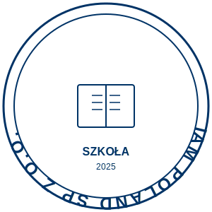

# Wzór Pieczęci Szkoły - IAM POLAND SP Z O.O.

## Opis

Oficjalny wzór pieczęci szkolnej dla IAM POLAND SP Z O.O. w formacie SVG (Scalable Vector Graphics).

## Pliki

- `pieczec-szkolna.svg` - Plik wzoru pieczęci w formacie SVG
- `wzor-pieczeci.html` - Podgląd pieczęci z instrukcją użycia (otwórz w przeglądarce)
- `INSTRUKCJA-PIECZEC.md` - Ten plik (instrukcja obsługi)

## Specyfikacja

### Wymiary
- **Format:** Okrągła pieczęć w kwadracie 300x300 px
- **Typ pliku:** SVG (skalowalne bez utraty jakości)
- **Średnica zewnętrzna:** 290 px
- **Średnica wewnętrzna:** 260 px

### Elementy pieczęci
1. **Podwójny okrąg obwódki** - granatowy (#003366)
2. **Tekst górny (łukiem):** "IAM POLAND SP Z O.O."
3. **Symbol centralny:** Otwarta książka (symbol edukacji)
4. **Tekst dolny:** "SZKOŁA"
5. **Rok:** "2025" (do aktualizacji w razie potrzeby)

### Kolory
- **Podstawowy kolor:** #003366 (granatowy)
- **Tło:** Przezroczyste/białe

## Zastosowanie

Pieczęć może być używana na:
- Dyplomach i certyfikatach
- Zaświadczeniach szkolnych
- Oficjalnych dokumentach
- Pismach urzędowych
- Materiałach promocyjnych szkoły

## Jak użyć pieczęci

### Opcja 1: Bezpośrednie użycie pliku SVG
1. Otwórz dokument w edytorze (Word, LibreOffice, InDesign, itp.)
2. Wstaw plik `pieczec-szkolna.svg`
3. Dostosuj rozmiar według potrzeb
4. Pieczęć zachowa ostrość w każdej wielkości

### Opcja 2: Konwersja do PNG
1. Otwórz plik SVG w programie graficznym (Inkscape, GIMP, Photoshop)
2. Eksportuj do formatu PNG z odpowiednią rozdzielczością:
   - **Dokumenty cyfrowe:** 300 DPI
   - **Druk wysokiej jakości:** 600 DPI
   - **Strony internetowe:** 72-150 DPI

### Opcja 3: Konwersja online
Użyj darmowych narzędzi online:
- CloudConvert (https://cloudconvert.com/svg-to-png)
- Online-Convert (https://www.online-convert.com/)
- Convertio (https://convertio.co/pl/svg-png/)

## Edycja pieczęci

### Zmiana roku
1. Otwórz plik `pieczec-szkolna.svg` w edytorze tekstu
2. Znajdź wiersz z tekstem "2025"
3. Zmień na aktualny rok
4. Zapisz plik

### Zmiana koloru
1. Otwórz plik SVG w edytorze tekstu
2. Znajdź wszystkie wystąpienia `#003366`
3. Zastąp wybranym kolorem (kod HEX)
4. Zapisz plik

### Profesjonalna edycja
Użyj programów graficznych:
- **Inkscape** (darmowy, open-source) - zalecane
- **Adobe Illustrator** (profesjonalny)
- **Figma** (online, darmowy dla podstawowego użytku)
- **CorelDRAW** (profesjonalny)

## Wskazówki techniczne

### Drukowanie
- **Rozmiar zalecany:** 30-50 mm średnicy dla dokumentów A4
- **Tryb druku:** Najlepsza jakość
- **Kolor:** Pełny kolor lub skala szarości

### Użycie cyfrowe
- Osadź pieczęć w PDF przed wysłaniem
- Dla dokumentów elektronicznych zapisz jako PNG z przezroczystym tłem
- Używaj rozdzielczości minimum 300 DPI dla skanów

### Zgodność z formatami
Format SVG jest obsługiwany przez:
- Microsoft Word (2016 i nowsze)
- LibreOffice / OpenOffice
- Adobe InDesign, Illustrator
- Google Docs (po konwersji do PNG)
- Przeglądarki internetowe (Chrome, Firefox, Safari, Edge)

## Wersjonowanie

- **Wersja:** 1.0
- **Data utworzenia:** 2025-10-26
- **Autor:** IAM POLAND SP Z O.O.
- **Ostatnia modyfikacja:** 2025-10-26

## Przykłady użycia

### W dokumentach Word
```
Wstaw → Obrazy → Wybierz plik pieczec-szkolna.svg
Dostosuj rozmiar: 40-50 mm
Ustaw opływanie tekstu: "Z przodu tekstu"
```

### W dokumentach PDF
```
Użyj Adobe Acrobat Pro:
Narzędzia → Edytuj PDF → Dodaj obraz → Wybierz SVG
```

### Na stronie internetowej
```html

```

## Licencja

Pieczęć jest własnością **IAM POLAND SP Z O.O.** i może być używana wyłącznie do celów oficjalnych przez upoważnione osoby.

## Kontakt

W razie pytań lub potrzeby modyfikacji wzoru pieczęci, skontaktuj się z działem administracji IAM POLAND SP Z O.O.

---

**Data wygenerowania:** 2025-10-26
**Repozytorium:** MDR-cosmomed-Izabela-Za-cka-
